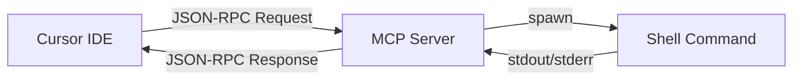
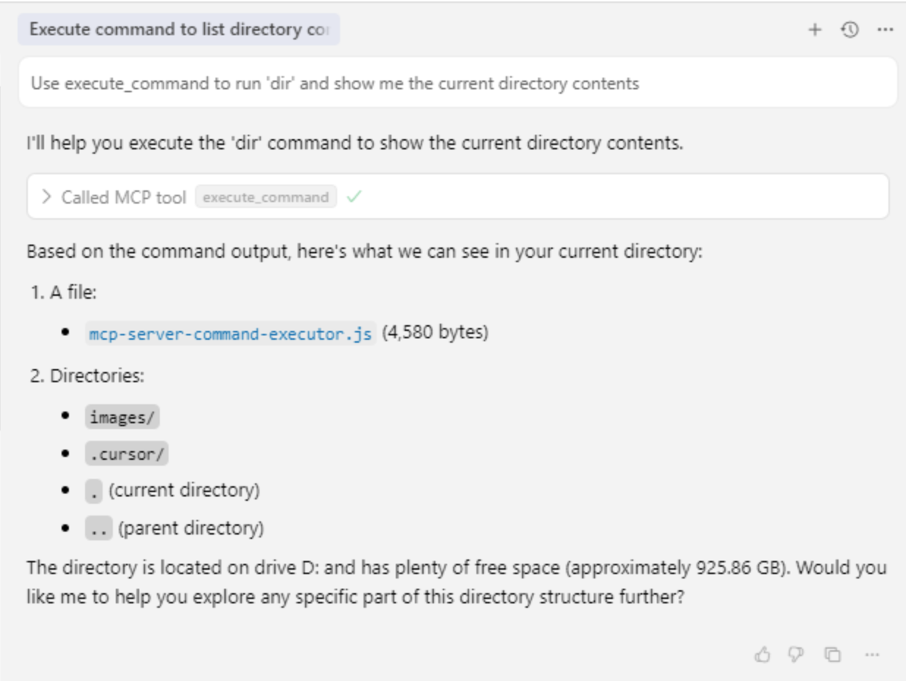
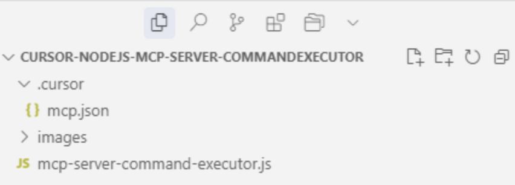
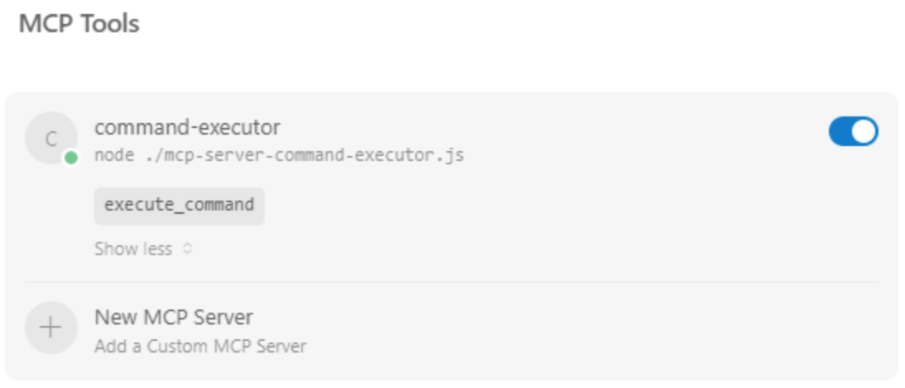

# 🚀 Cursor NodeJS MCP Server - Command Executor

[](https://opensource.org/licenses/MIT)
[](https://nodejs.org/)
[](https://modelcontextprotocol.io/)
[]()

A lightweight **Model Context Protocol (MCP) Server** for Cursor IDE that enables seamless command-line execution directly from AI conversations. Execute shell commands, run scripts, and interact with your system through natural language.

## ✨ Features

- 🔧 **Single-Purpose Tool**: Execute any shell command with arguments and custom working directory
- 🎯 **Zero Dependencies**: No `node_modules` or `package.json` required - pure Node.js implementation
- 🚀 **Instant Setup**: Drop-in solution for Cursor IDE with minimal configuration
- 📝 **Detailed Output**: Returns stdout, stderr, and exit codes for comprehensive debugging
- 🔄 **Cross-Platform**: Works on Windows, macOS, and Linux

## 🏗️ Architecture

This MCP server implements the **Model Context Protocol v2025-06-09** specification, providing a standardized interface for AI tools to interact with external systems. It operates as a JSON-RPC server communicating via stdin/stdout.

### Protocol Flow


## 📦 Installation

### Method 1: Clone Repository
```bash
git clone https://github.com/raires/Cursor-NodeJS-MCP-Server-CommandExecutor.git
cd Cursor-NodeJS-MCP-Server-CommandExecutor
```

### Method 2: Download Single File
Download `mcp-server-command-executor.js` to your desired location.

## ⚙️ Configuration

### 1. Cursor IDE Setup

The following configuration to your Cursor settings is already in place:

**File: `~/.cursor/mcp.json` (no change is required)**

```json
{
  "mcpServers": {
    "command-executor": {
      "command": "node",
      "args": ["./mcp-server-command-executor.js"]
    }
  }
}
```

## 🎮 Usage

Once configured, you can use natural language in Cursor to execute commands:

### Examples

**Basic Commands:**
- "Use execute_command to list all files in the current directory"
- "Use execute_command to check the current Git status"
- "Use execute_command to Install npm packages"

**Advanced Usage:**
- "Use execute_command to run tests in the project root directory"
- "Use execute_command to execute a Python script with specific arguments"
- "Use execute_command to check system resources and running processes"

### Tool Schema

The server provides one tool: `execute_command`

```json
{
  "name": "execute_command",
  "description": "Execute a command in the system shell",
  "inputSchema": {
    "type": "object",
    "properties": {
      "command": {
        "type": "string",
        "description": "Command to execute",
        "required": true
      },
      "args": {
        "type": "array",
        "items": {"type": "string"},
        "description": "Command arguments"
      },
      "cwd": {
        "type": "string",
        "description": "Working directory"
      }
    }
  }
}
```

## 📸 Screenshots

### MCP Server in Action

*Executing commands through Cursor's AI interface*

### MCP Server


### Folder structure


## 🔧 Technical Details

### MCP Protocol Implementation

The server implements the following MCP methods:

- **`initialize`**: Protocol handshake and capability declaration
- **`tools/list`**: Returns available tools (execute_command)
- **`tools/call`**: Executes the requested tool
- **`notifications/initialized`**: Acknowledges initialization

### Command Execution Flow

1. **Request Reception**: JSON-RPC request received via stdin
2. **Validation**: Command and parameters validated
3. **Execution**: Child process spawned using Node.js `child_process.spawn`
4. **Output Capture**: stdout and stderr streams captured
5. **Response**: Results formatted and returned as JSON-RPC response

### Security Considerations

⚠️ **Important**: This tool executes arbitrary shell commands. Use responsibly and:

- Only use in trusted development environments
- Be cautious with user input
- Consider implementing command restrictions for production use
- Review commands before execution

## 🤝 Contributing

Contributions are welcome! Here's how you can help:

1. **Fork** the repository
2. **Create** a feature branch (`git checkout -b feature/amazing-feature`)
3. **Commit** your changes (`git commit -m 'Add amazing feature'`)
4. **Push** to the branch (`git push origin feature/amazing-feature`)
5. **Open** a Pull Request

### Development Guidelines

- Follow existing code style
- Add comments for complex logic
- Test on multiple platforms
- Update documentation as needed

## 📋 Requirements

- **Node.js**: Version 14 or higher
- **Cursor IDE**: Latest version with MCP support
- **Operating System**: Windows 10+, macOS 10.14+, or Linux

## 🐛 Troubleshooting

### Common Issues

**Server not starting:**
- Verify Node.js installation: `node --version`
- Check file path in Cursor configuration
- Ensure file permissions (Linux/macOS)

**Commands not executing:**
- Check working directory permissions
- Verify command exists in system PATH
- Review stdout/stderr output for errors

**JSON-RPC errors:**
- Validate JSON syntax in requests
- Check MCP protocol version compatibility
- Review server logs for detailed error messages

## 📄 License

This project is licensed under the MIT License - see the [LICENSE](LICENSE) file for details.

## 🙏 Acknowledgments

- [Model Context Protocol](https://modelcontextprotocol.io/) - For the excellent protocol specification
- [Cursor IDE](https://cursor.sh/) - For providing the platform and MCP integration
- Node.js Community - For the robust runtime environment

## 📞 Support

- **Issues**: [GitHub Issues](https://github.com/raires/Cursor-NodeJS-MCP-Server-CommandExecutor/issues)
- **Discussions**: [GitHub Discussions](https://github.com/raires/Cursor-NodeJS-MCP-Server-CommandExecutor/discussions)

---

**Made with ❤️ for the Cursor IDE community**

## 🏷️ Tags

`cursor-ide` `mcp-server` `nodejs` `command-executor` `shell` `ai-tools` `development` `automation` `json-rpc` `model-context-protocol` 